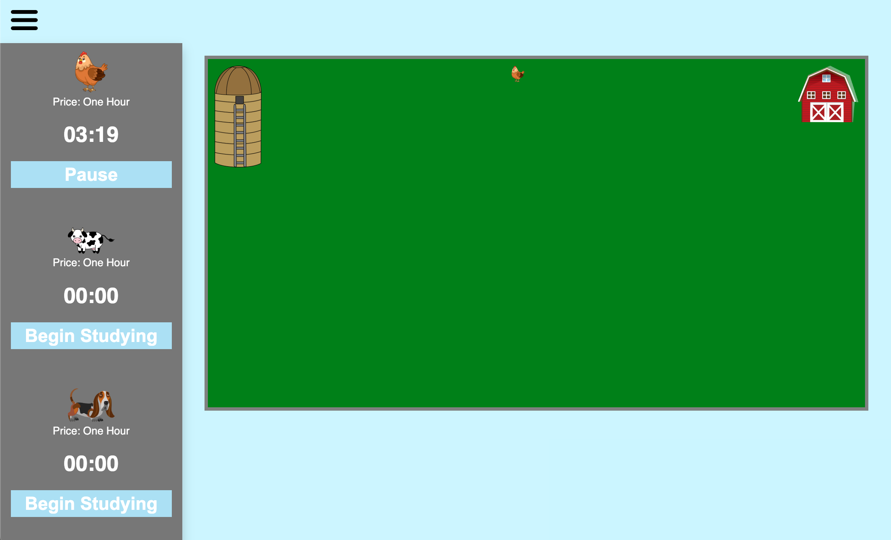
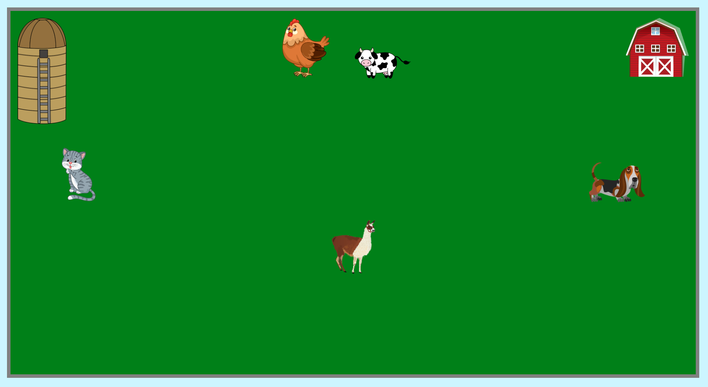

# ProcrastinationFarm # 

Welcome to the **ProcrastinationFarm**! 

**Procrastination Farm** is a lighthearted timer-based productivity app I built for a hackathon in 2020 during covid to make starting difficult tasks a little more fun. The idea is simple: when you start a task you've been putting off, you also start growing a farm animal. With each session, your farm expands — one task, one animal at a time. This project has no storage mechanism though so every time you reload the page, it will delete all of your progress growing your farm - so fun! 

This project was built entirely in html, css, and javascript — all within a single html file and a single css file — but I still have a lot of love for this project as this was my very first project using javascript (which is extremly obvious if you take a peek at the farm.html file). For those younger than me, this project was built before tools like ChatGPT so don't come at me for the quality of code in this project, I know, I know, it is really bad. 

## How It Works

1. Choose a farm animal from the menu.
2. Set a timer and begin a task you've been procrastinating.
3. As the timer runs, the selected animal gradually appears and grows.
4. Grow Your Farm - Each completed timer adds another animal to your Procrastination Farm.

## Lessons Learned

- Writing code all in one file is so fun.
- Naming things button1, button2, image1, image2, etc. is also so fun.
- Dry code, totally not needed at all.

## Known Bugs

- The animals do not grow at a linear rate.
- The page scrolls horizontally in case you wanted to go that way :) 

## Screenshots

